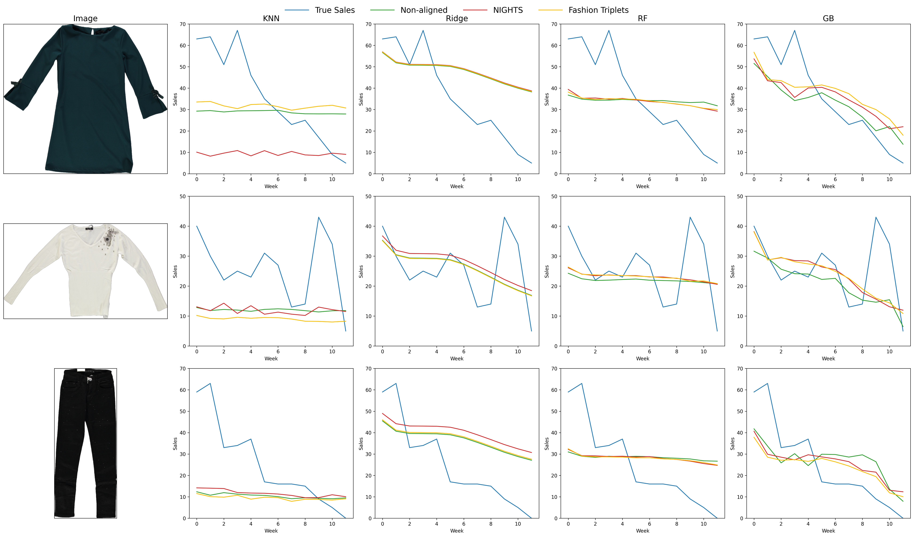

# Evaluation of Perceptual Alignment in Deep Vision Models for Fashion Sales Prediction

## Project Overview

This repository contains the code and experiments developed for my Master’s thesis. The thesis investigates whether fine-tuning deep vision models using human similarity judgments (perceptual alignment) improves the quality of image embeddings for fashion sales prediction.

Deep vision models are aligned using human-annotated image triplets from both a large, domain-agnostic dataset (NIGHTS) and a small, fashion-specific dataset. The resulting image embeddings are combined with contextual metadata and used to train multiple sales prediction models. The repository includes code for perceptual alignment, embedding extraction, sales forecasting, and experiment evaluation. The deep vision models used in this thesis include ResNet-50, CLIP32, CLIP16, DINOv1, DINOv2, DINOv3 which can be fine-tuned either with MLP or LoRA. The prediction models used in this thesis are kNN regression, ridge regression, random forest regression and gradient boosting regression.

## Experimental Pipeline

The experiments in this repository follow a four-stage pipeline:
1. **Perceptual alignment**: Deep vision models are fine-tuned using human similarity judgments.
2. **Embedding extraction**: Fashion product images are embedded using the (fine-tuned or vanilla) vision models.
3. **Sales prediction**: Regression models are trained on the image embeddings together with contextual metadata.
4. **Statistical evaluation**: A paired bootstrap test is applied to compare prediction errors and assess whether perceptual alignment leads to statistically significant improvements.

The overall training process is illustrated below.


## Key Findings

- **Perceptual alignment improves fashion sales prediction**: Fine-tuning deep vision models on human similarity judgments leads to statistically significant improvements in sales forecasting accuracy.

- **General and domain-specific alignment both work**: Alignment using a large, domain-agnostic dataset (NIGHTS) as well as a very small fashion-specific dataset (190 triplets) improves downstream prediction performance, highlighting the sample efficiency of human judgment data.

- **Prediction model choice matters more than vision backbone**: Across all experiments, more expressive models such as Gradient Boosting and Random Forest outperform simpler models like kNN and Ridge Regression, regardless of the vision model used.

- **Nonlinear models benefit most from alignment**: Improvements from perceptually aligned embeddings are primarily captured by nonlinear prediction models, while simpler models show limited or no gains.

- **Smaller vision models benefit disproportionately**: Although larger vision models perform better in their vanilla form, perceptual alignment yields larger relative improvements for smaller models, narrowing or even closing the performance gap.

- **CNNs and Vision Transformers respond similarly**: Both architecture types benefit from perceptual alignment, suggesting that the effect is largely architecture-agnostic.

- **Fine-tuning strategy has limited impact**: No consistent advantage is observed between LoRA-based fine-tuning and MLP-based adaptation; the main gains stem from the alignment objective itself.

- **Early stopping is crucial**: Excessive fine-tuning on perceptual alignment datasets can harm downstream performance, whereas early stopping consistently leads to better generalization.

Below are some example prediction for some random fashion items for the DINOv1 model.



## Repository Structure

```text
├── README.md
├── requirements.txt
├── config/                         # YAML configuration files for experiment settings
├── datasets/                       # Perceptual alignment datasets (NIGHTS, Fashion Triplets) and fashion sales datasets
├── notebooks/                      # Contains notebooks for visualizations
├── src/                            # Source code for data processing, training, and evaluation
├── visualizations/                 # Generated figures and visual assets
├── vision_model_training_script/   # Scripts for fine-tuning deep vision models (MLP / LoRA)
├── experiments/                    # Stored experiment results (created during execution, not tracked)
├── models/                         # Trained prediction models (created during execution, not tracked)
├── studies/                        # Hyperparameter optimization studies (created during execution, not tracked)
├── main_training_script.ipynb      # Trains sales prediction models on extracted embeddings
├── statistical_testing.ipynb       # Paired bootstrap tests for statistical significance
├── visualization.ipynb             # Creates figures and plots for analysis
└── wandb_key                       # Weights & Biases API key file (not tracked, required for logging)

