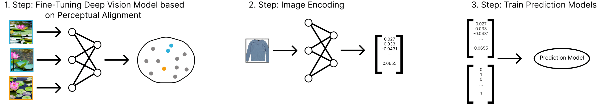

# Evaluation of Perceptual Alignment in Deep Vision Models for Fashion Sales Prediction

This repository contains the code and experiments developed for my Master’s thesis. The thesis investigates whether fine-tuning deep vision models using human similarity judgments (perceptual alignment) improves the quality of image embeddings for fashion sales prediction.

Deep vision models are aligned using human-annotated image triplets from both a large, domain-agnostic dataset (NIGHTS) and a small, fashion-specific dataset. The resulting image embeddings are combined with contextual metadata and used to train multiple sales prediction models. The repository includes code for perceptual alignment, embedding extraction, sales forecasting, and experiment evaluation.

## Experimental Pipeline

The experiments in this repository follow a four-stage pipeline:
1. **Perceptual alignment**: Deep vision models are fine-tuned using human similarity judgments.
2. **Embedding extraction**: Fashion product images are embedded using the (fine-tuned or vanilla) vision models.
3. **Sales prediction**: Regression models are trained on the image embeddings together with contextual metadata.
4. **Statistical evaluation**: A paired bootstrap test is applied to compare prediction errors and assess whether perceptual alignment leads to statistically significant improvements.

The overall training process is illustrated below.

